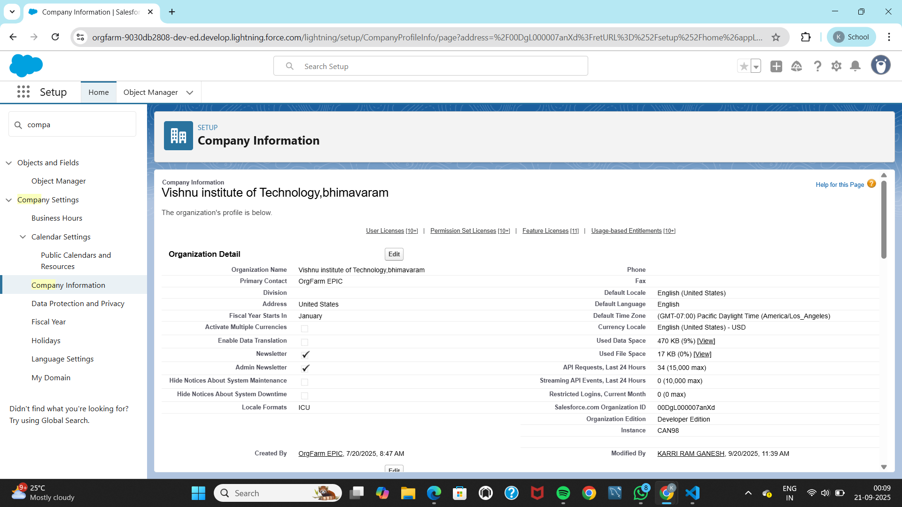
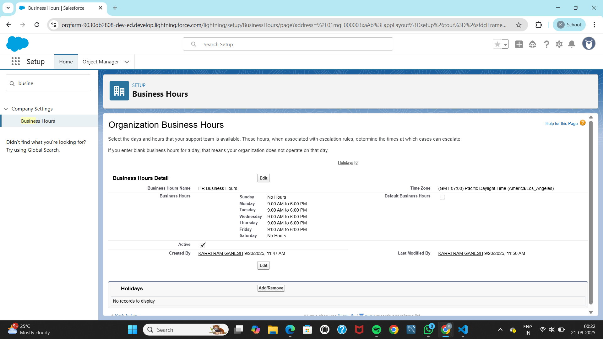
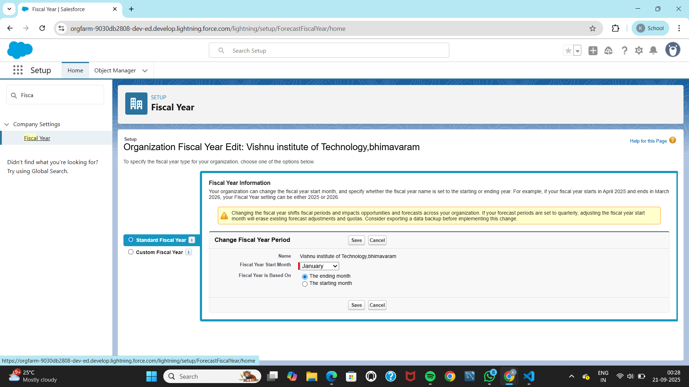
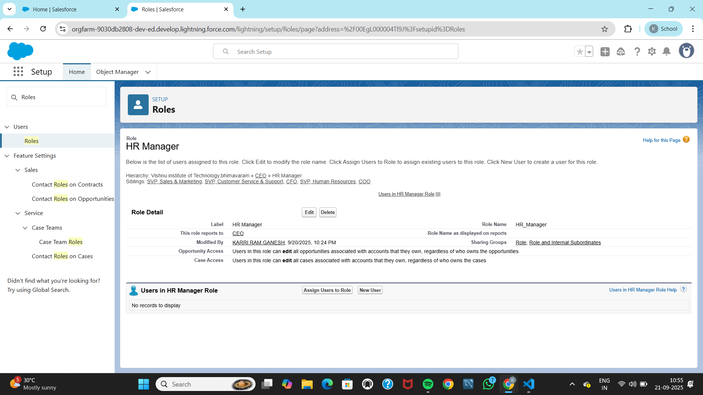
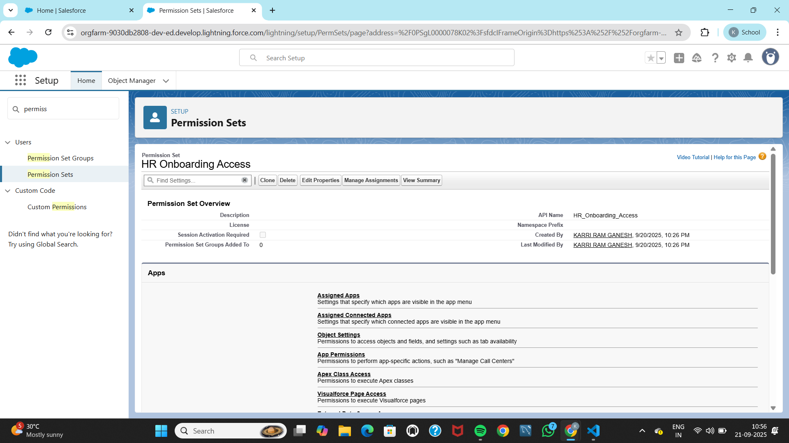
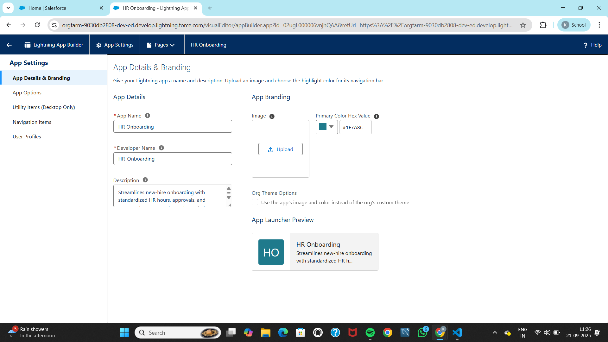
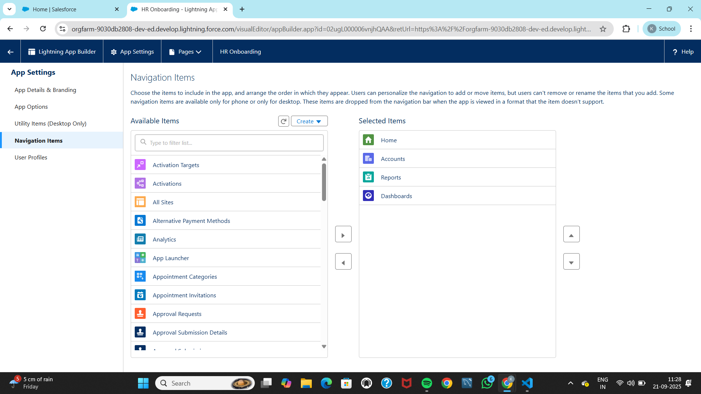

# Phase 2: Org Setup & Configuration

## Company Information
**Purpose:**  
Sets org-wide locale, time zone, and currency so dates, times, and amounts render consistently for HR processes and reports.

**Screenshot:** Company Information page.  


**Metadata:**  
Organization settings are not retrieved as a single file; they are part of org configuration.  
For audit purposes, note the chosen **Locale**, **Time Zone**, and **Currency** in documentation.

---

## Business Hours & Holidays
**Purpose:**  
Defines HR’s working hours for approvals, due times, and SLA calculations. Holidays ensure non-working days are respected.

**Screenshot:** HR Business Hours and Holidays list.  


**Metadata (BusinessHoursSettings):**
```xml
<?xml version="1.0" encoding="UTF-8"?>
<BusinessHoursSettings xmlns="http://soap.sforce.com/2006/04/metadata">
    <businessHours>
        <active>true</active>
        <default>true</default>
        <name>Default</name>
        <timeZoneId>America/Los_Angeles</timeZoneId>
    </businessHours>
    <businessHours>
        <active>true</active>
        <default>false</default>
        <name>HR Business Hours</name>
        <mondayStartTime>09:00:00.000Z</mondayStartTime>
        <mondayEndTime>18:00:00.000Z</mondayEndTime>
        <tuesdayStartTime>09:00:00.000Z</tuesdayStartTime>
        <tuesdayEndTime>18:00:00.000Z</tuesdayEndTime>
        <wednesdayStartTime>09:00:00.000Z</wednesdayStartTime>
        <wednesdayEndTime>18:00:00.000Z</wednesdayEndTime>
        <thursdayStartTime>09:00:00.000Z</thursdayStartTime>
        <thursdayEndTime>18:00:00.000Z</thursdayEndTime>
        <fridayStartTime>09:00:00.000Z</fridayStartTime>
        <fridayEndTime>18:00:00.000Z</fridayEndTime>
        <timeZoneId>America/Los_Angeles</timeZoneId>
    </businessHours>
</BusinessHoursSettings>
```

---

## Fiscal Year
**Purpose:**  
Confirmed **Standard Fiscal Year** with start month **January** and “Based on ending month.”  
This keeps analytics and dashboards in sync with HR’s calendar-year planning without enabling custom fiscal years.

**Screenshot:** Fiscal Year settings.  


---

## Users
**Purpose:**  
Created at least one **HR Test User** for role/permission testing during build and UAT.  
This ensures realistic security testing early in the project.

**Screenshot:** HR Test User.  


---

## Profiles & Roles
**Purpose:**  
- Used a **standard profile** as a base for HR.  
- Created a minimal role hierarchy: **CEO > HR Manager**.  

This setup supports top-down visibility and approval routing while keeping administration simple.

---

## Permission Set
**Purpose:**  
Created **“HR Onboarding Access”** (empty baseline) to centralize future object/field/tab permissions.  
This follows **permission-set-led security** best practices instead of relying only on profiles.

**Screenshot:** Permission Set.  


---

## App Manager
**Purpose:**  
Created the **“HR Onboarding” Lightning App** with a clear brand color and starter navigation (Home, Accounts, Reports, Dashboards).  
This provides HR with a dedicated workspace.

**Screenshot:** HR Onboarding App.  


**Metadata (CustomApplication):**
```xml
<?xml version="1.0" encoding="UTF-8"?>
<CustomApplication xmlns="http://soap.sforce.com/2006/04/metadata">
    <brand>
        <headerColor>#1F7A8C</headerColor>
        <shouldOverrideOrgTheme>false</shouldOverrideOrgTheme>
    </brand>
    <description>Streamlines new-hire onboarding with standardized HR hours, approvals, and access setup across roles and permissions.</description>
    <formFactors>Small</formFactors>
    <formFactors>Large</formFactors>
    <label>HR Onboarding</label>
    <navType>Standard</navType>
    <tabs>standard-ApprovalsHome</tabs>
    <tabs>standard-Account</tabs>
    <tabs>standard-report</tabs>
    <tabs>standard-Dashboard</tabs>
    <uiType>Lightning</uiType>
    <utilityBar>HR_Onboarding_UtilityBar</utilityBar>
</CustomApplication>
```

---

## Navigation Items
**Screenshot:** Navigation Items in HR Onboarding app.  


---

## Manifest Entries Used for Retrieval
**Rationale:** Ensures consistent retrieval of all Phase 2 components.
```xml
<Package xmlns="http://soap.sforce.com/2006/04/metadata">
  <types>
    <members>*</members>
    <name>Role</name>
  </types>
  <types>
    <members>BusinessHours</members>
    <name>Settings</name>
  </types>
  <types>
    <members>*</members>
    <name>CustomApplication</name>
  </types>
  <types>
    <members>*</members>
    <name>CustomTab</name>
  </types>
  <version>64.0</version>
</Package>
```

---

## Other Configurations
- **OWD:** Kept default settings.  
- **Sharing Rules:** Not yet defined.  
- **Login Access Policies:** Left as default.  

---

