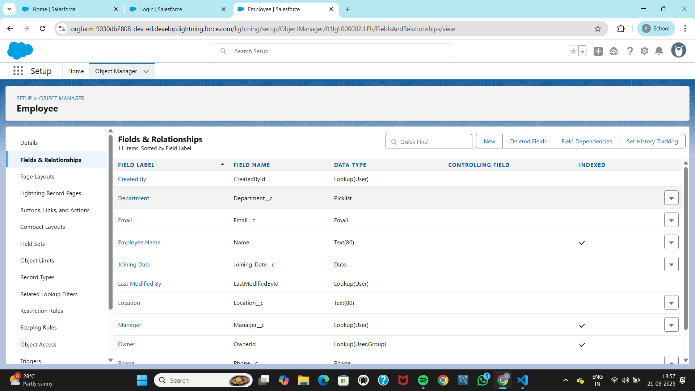
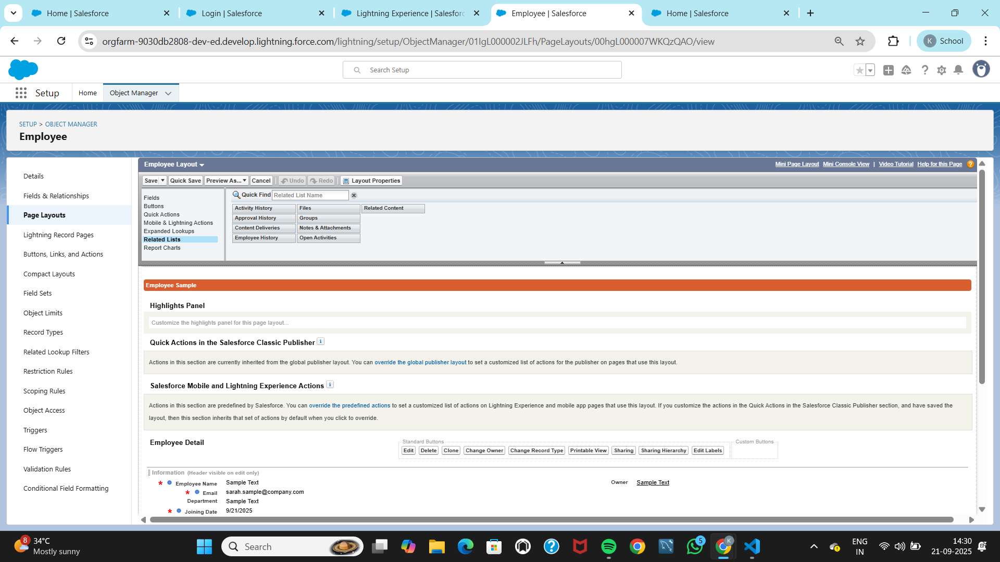

# Phase 3 — Data Modeling and Relationships

## Objective
Design the HR Onboarding data model with **Employee__c** as the parent object and two child objects — **Onboarding_Document__c** and **Training_Assignment__c**.  
The goal is to structure onboarding data in Salesforce so HR can track employee details, documents, and training in a simple and repeatable way.  
All objects, fields, layouts, and tabs are versioned in source control for reproducibility.

---

## Scope
- **Employee__c (Parent)** object with core HR fields and history tracking.  
- Two **child objects** with **Master-Detail** to Employee__c:  
  - **Onboarding_Document__c** → for document collection and review.  
  - **Training_Assignment__c** → for training tasks and progress tracking.  
- Tabs created for all three objects and added to the **HR Onboarding App**.  
- Optimized page layouts with sections and related lists.  
- Optional list views for quick HR triage.  
- `package.xml` entries defined for reliable metadata retrieval and versioning.  

---

## Employee__c (Parent Object)

### Creation Settings
- Enabled **Reports**, **Track Activities**, and **Track Field History**.  
- **Record Name** set to **Text**.  

### Business Purpose
The **Employee__c** record is the **master record** for each onboarding case.  
It serves as the central point for approvals, document tracking, training assignments, and reporting.

### Fields
- **Email__c** (Email, Required): Employee’s work email for all notifications.  
- **Department__c** (Picklist: HR; IT; Finance; Operations; Sales; Marketing. Default: HR): Ensures consistent routing and reporting.  
- **Joining_Date__c** (Date, Required): Defines the onboarding start date and anchors timelines.  
- **Status__c** (Picklist: Draft; Documents Pending; Manager Approved; HR Approved; Completed. Default: Draft): Tracks onboarding progress.  
- **Manager__c** (Lookup → User): Links employee record to their manager for approvals and reporting.  
- **Phone__c** (Phone, Optional): Contact number for communication.  
- **Location__c** (Text 80, Optional): Captures work location.  

### Page Layout (Employee Layout)
- **Sections**:  
  - *Personal Info*: Email, Phone, Location, Department.  
  - *Employment*: Joining Date, Manager, Status.  
- **Related Lists**: Files, Open Activities, Activity History.  
- **Tab**: Employees tab created and added to HR Onboarding app navigation.  

---

## Onboarding_Document__c (Child Object 1)

### Creation Settings
- Enabled **Reports** and **Activities**.  
- Deployment status: **Deployed**.  
- Search: **Allowed**.  

### Relationship
- **Employee__c (Master-Detail → Employee__c)**  
  - Child records inherit ownership and sharing rules from the parent.  

### Fields
- **Document_Type__c** (Picklist: ID Proof; Address Proof; Education; Offer Letter. Restricted values).  
- **Status__c** (Picklist: Pending; Submitted; Approved; Rejected. Default: Pending).  
- **File_Url__c** (URL 255, Optional): To link externally stored files when not attaching directly.  

### Page Layout (Onboarding Document Layout)
- **Top Field Order**: Employee, Document Type, Status, File URL.  
- **Related Lists**: Files, Activities.  

### Navigation
- **Tab**: Onboarding Documents tab created and optionally added to HR Onboarding app.  
- **Employee Layout**: Related List “Onboarding Documents” added.  

---

## Training_Assignment__c (Child Object 2)

### Creation Settings
- Enabled **Reports** and **Activities**.  
- Deployment status: **Deployed**.  
- Search: **Allowed**.  

### Relationship
- **Employee__c (Master-Detail → Employee__c)**  
  - Links training tasks to the parent employee record.  

### Fields
- **Module__c** (Text 80): Name of the training module.  
- **Due_Date__c** (Date): Training completion deadline.  
- **Completion_Status__c** (Picklist: Not Started; In Progress; Completed. Default: Not Started).  

### Page Layout (Training Assignment Layout)
- **Top Field Order**: Employee, Module, Due Date, Completion Status.  
- **Related Lists**: Files, Activities.  

### Navigation
- **Tab**: Training Assignments tab created and optionally added to HR Onboarding app.  
- **Employee Layout**: Related List “Training Assignments” added.  

---

## Optional List Views
These list views improve HR efficiency in tracking pending tasks.

### Onboarding Documents
- **Name**: Pending Docs  
- **Filter**: Status = Pending  
- **Columns**: Document Type, Status, Employee.  

### Training Assignments
- **Name**: Open Trainings  
- **Filter**: Completion Status ≠ Completed  
- **Columns**: Module, Due Date, Employee, Status.  

---

## package.xml Manifest Entries
To ensure reliable metadata retrieval, explicit entries are used (wildcards for CustomField often fail).  

```xml
<types>
  <members>Employee__c</members>
  <members>Onboarding_Document__c</members>
  <members>Training_Assignment__c</members>
  <name>CustomObject</name>
</types>

<types>
  <members>Employee__c.Email__c</members>
  <members>Employee__c.Department__c</members>
  <members>Employee__c.Joining_Date__c</members>
  <members>Employee__c.Status__c</members>
  <members>Employee__c.Manager__c</members>
  <members>Employee__c.Phone__c</members>
  <members>Employee__c.Location__c</members>
  <members>Onboarding_Document__c.Document_Type__c</members>
  <members>Onboarding_Document__c.Status__c</members>
  <members>Onboarding_Document__c.File_Url__c</members>
  <members>Onboarding_Document__c.Employee__c</members>
  <members>Training_Assignment__c.Module__c</members>
  <members>Training_Assignment__c.Due_Date__c</members>
  <members>Training_Assignment__c.Completion_Status__c</members>
  <members>Training_Assignment__c.Employee__c</members>
  <name>CustomField</name>
</types>

<types>
  <members>Employee__c</members>
  <members>Onboarding_Document__c</members>
  <members>Training_Assignment__c</members>
  <name>CustomTab</name>
</types>
```

---

## Outcome
- Created **Employee__c**, **Onboarding_Document__c**, and **Training_Assignment__c** objects.  
- Defined **Master-Detail relationships** for secure ownership and rollup reporting.  
- Configured **fields, layouts, related lists, and tabs** for HR usability.  
- Built **list views** to speed document and training management.  
- Added **manifest entries** for reliable versioning in source control.  

✅ **Phase 3 Completed**  
Next: **Phase 4 — Process Automation (Admin)**: Validation Rules, Flows, Workflow Rules, and Approval Processes.
