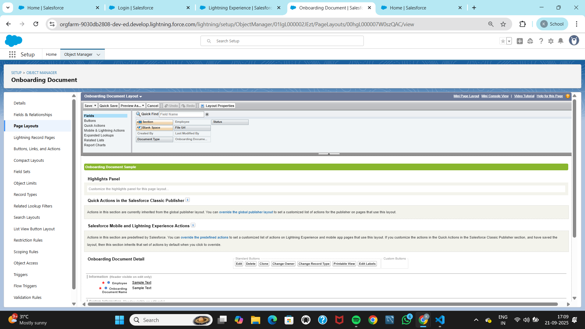
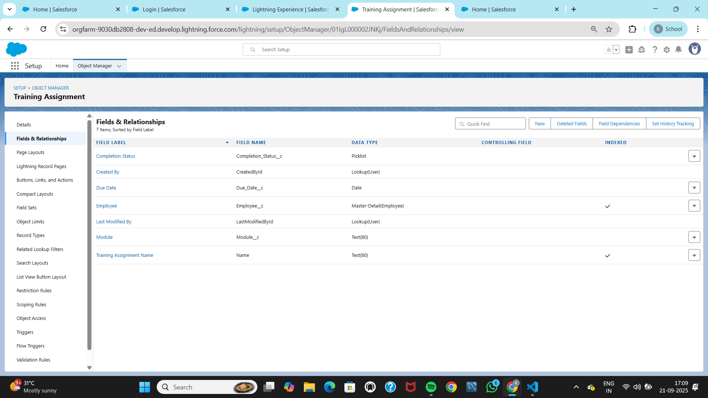
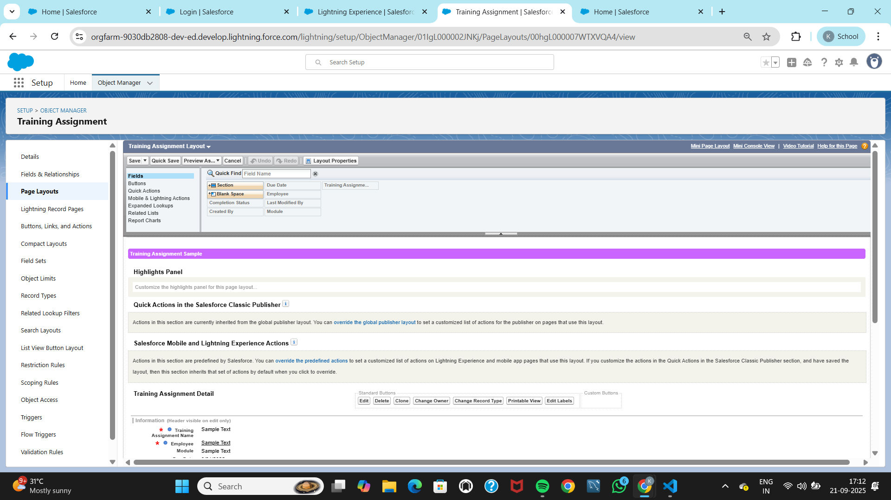

# Phase 3 — Data Model & Relationships

## Objective
The goal of this phase is to **model the core HR onboarding data** in Salesforce.  
- **Employee__c** acts as the parent object and the hub record updated throughout onboarding.  
- **Onboarding_Document__c** and **Training_Assignment__c** are related objects linked to Employee via **Master-Detail** relationships.  
- Tabs, Page Layouts, and List Views ensure HR has a simple, user-friendly experience.  
- Metadata is tracked via package.xml to make the configuration reproducible in source control.

---

## Employee Object

### What & Why
The **Employee__c** object is the **main record** representing a new hire. HR will use this record to manage all onboarding tasks, documents, and training assignments.  

### How
- Object created as **Custom Object**: `Employee__c`  
- **Reports** and **Activities** enabled (to allow tasks/events tracking).  
- **Field History Tracking** enabled for auditing changes.  
- **Record Name** set as Text (Employee Name).  

### Fields
- **Email__c** (Email, Required) → Employee’s work email for notifications.  
- **Department__c** (Picklist) → HR, IT, Finance, Operations, Sales, Marketing. Default: HR.  
- **Joining_Date__c** (Date, Required) → Start date of employment.  
- **Status__c** (Picklist) → Draft, Documents Pending, Manager Approved, HR Approved, Completed. Default: Draft.  
- **Manager__c** (Lookup → User) → Manager for approvals.  
- **Phone__c** (Phone, Optional).  
- **Location__c** (Text 80, Optional).  


### UX Configuration
- **Page Layout Sections**:  
  - *Personal Info* → Email, Phone, Location, Department.  
  - *Employment* → Joining Date, Manager, Status.  
- **Related Lists**: Files and Activities for attaching documents and tasks.  
- **Tab**: Employees tab created and added to HR Onboarding app navigation.  


---

## Onboarding Document Object

### What & Why
The **Onboarding_Document__c** object tracks employee-specific documents (ID proof, offer letter, etc.).  
This ensures HR can validate and approve documents digitally instead of relying on manual files.  

### How
- Object created as **Custom Object**: `Onboarding_Document__c`.  
- **Reports** and **Activities** enabled.  
- Related to Employee__c via **Master-Detail** relationship (so ownership/sharing is inherited).  

### Fields
- **Employee__c** (Master-Detail → Employee__c).  
- **Document_Type__c** (Picklist) → ID Proof, Address Proof, Education, Offer Letter.  
- **Status__c** (Picklist) → Pending, Submitted, Approved, Rejected. Default: Pending.  
- **File_Url__c** (URL 255, Optional) → For cases where files are stored externally.  


### UX Configuration
- **Layout Order**: Employee, Document Type, Status, File URL.  
- **Related Lists**: Files, Activities.  
- **Tab**: Documents tab created and added to Employee page layout.  


---

## Training Assignment Object

### What & Why
The **Training_Assignment__c** object manages onboarding trainings assigned to each employee.  
This allows HR to track progress on compliance modules, soft skills, or technical training.  

### How
- Object created as **Custom Object**: `Training_Assignment__c`.  
- **Reports** and **Activities** enabled.  
- Related to Employee__c via **Master-Detail** relationship.  

### Fields
- **Employee__c** (Master-Detail → Employee__c).  
- **Module__c** (Text 80) → Training module name.  
- **Due_Date__c** (Date) → Training completion deadline.  
- **Completion_Status__c** (Picklist) → Not Started, In Progress, Completed. Default: Not Started.  


### UX Configuration
- **Layout Order**: Employee, Module, Due Date, Completion Status.  
- **Related Lists**: Files, Activities.  
- **Tab**: Trainings tab created and added to Employee page layout.  

---

## List Views (Recommended)

### Onboarding Documents
- **Name**: Pending Docs  
- **Filter**: Status = Pending  
- **Columns**: Document Type, Status, Employee.  

### Training Assignments
- **Name**: Open Trainings  
- **Filter**: Completion Status ≠ Completed  
- **Columns**: Module, Due Date, Employee, Status.  

These list views help HR quickly triage pending documents and upcoming training tasks.

---

## Manifest Entries (package.xml)

**Why:** Some Salesforce metadata retrieval tools reject wildcards for CustomFields.  
Therefore, explicit field members are listed for reliability.  

```xml
<types>
  <members>Employee__c</members>
  <members>Onboarding_Document__c</members>
  <members>Training_Assignment__c</members>
  <name>CustomObject</name>
</types>

<types>
  <members>Employee__c.Email__c</members>
  <members>Employee__c.Department__c</members>
  <members>Employee__c.Joining_Date__c</members>
  <members>Employee__c.Status__c</members>
  <members>Employee__c.Manager__c</members>
  <members>Employee__c.Phone__c</members>
  <members>Employee__c.Location__c</members>
  <members>Onboarding_Document__c.Document_Type__c</members>
  <members>Onboarding_Document__c.Status__c</members>
  <members>Onboarding_Document__c.File_Url__c</members>
  <members>Onboarding_Document__c.Employee__c</members>
  <members>Training_Assignment__c.Module__c</members>
  <members>Training_Assignment__c.Due_Date__c</members>
  <members>Training_Assignment__c.Completion_Status__c</members>
  <members>Training_Assignment__c.Employee__c</members>
  <name>CustomField</name>
</types>

<types>
  <members>Employee__c</members>
  <members>Onboarding_Document__c</members>
  <members>Training_Assignment__c</members>
  <name>CustomTab</name>
</types>
```

---

## Outcome
- Created **Employee__c**, **Onboarding_Document__c**, and **Training_Assignment__c** objects.  
- Defined **Master-Detail relationships** for controlled access and reporting.  
- Added **fields, layouts, tabs, and related lists** for a streamlined HR experience.  
- Prepared **manifest entries** for reliable source retrieval.  

